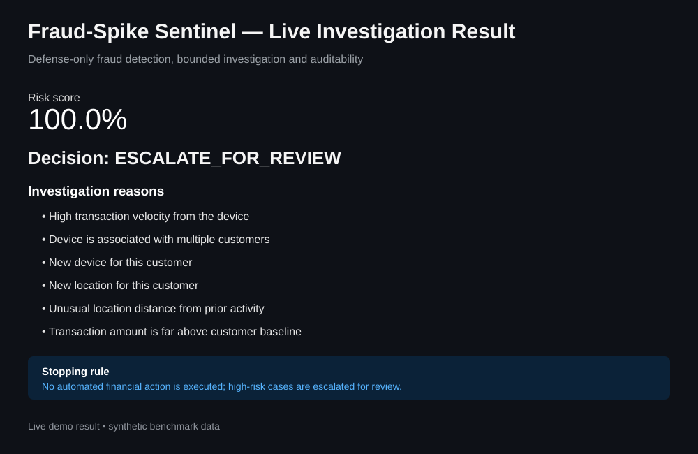

# Fraud-Spike Sentinel

A defense-only transaction fraud detection and investigation system for identifying unusual activity and routing high-risk transactions for review.

## 🚀 Live Demo

**Try the deployed Streamlit dashboard:** open the Streamlit app URL provided with this project submission.

### Live investigation result

The dashboard takes transaction and behavioral signals, calculates a risk score, shows the main reasons behind the result, recommends a bounded action, and records an audit event.



**Example result:** `100.0%` risk score → `ESCALATE_FOR_REVIEW`

> The screenshot/visual above is a representative result from the live demo using synthetic benchmark data.

## Project capabilities

- Synthetic transaction data generation
- Separate training and test data
- Fraud classification and performance measurement
- Risk scoring for individual transactions
- Clear investigation reasons based on transaction behavior
- Bounded investigation workflow
- Audit trail for investigation decisions
- FastAPI backend
- Streamlit dashboard
- Automated tests and GitHub Actions CI

> This project uses synthetic data. It does not connect to live payment systems and does not perform offensive security activity.

## How it works

1. Transaction and behavioral information is collected as input.
2. The detection model calculates the probability that the transaction is suspicious.
3. The investigation layer checks the transaction signals and identifies the strongest reasons for the result.
4. The system assigns one of three outcomes: `ALLOW_MONITORING`, `VERIFY`, or `ESCALATE_FOR_REVIEW`.
5. High-risk cases are routed for human review rather than automatically taking a financial action.
6. An audit event records the workflow, decision, and timestamp.

## Project structure

```text
fraud-spike-sentinel/
├── app/
│   ├── api.py
│   ├── investigator.py
│   └── model_service.py
├── data/
├── models/
├── scripts/
│   ├── generate_data.py
│   └── train.py
├── tests/
│   └── test_investigator.py
├── dashboard.py
├── requirements.txt
└── .gitignore
```

## Quick start

### 1. Create an environment

Windows:

```powershell
python -m venv .venv
.venv\Scripts\activate
```

macOS/Linux:

```bash
python3 -m venv .venv
source .venv/bin/activate
```

### 2. Install dependencies

```bash
pip install -r requirements.txt
```

### 3. Generate synthetic transactions

```bash
python scripts/generate_data.py --rows 50000
```

### 4. Train the detection model

```bash
python scripts/train.py
```

This creates:

- `models/fraud_model.joblib`
- `models/metrics.json`

### 5. Quick launch on Windows

After installing Python, you can also run `run_project.bat` to install dependencies, prepare the model, and open the API/dashboard in separate terminals.

### 6. Start the API

```bash
uvicorn app.api:app --reload
```

API docs:

`http://127.0.0.1:8000/docs`

### 7. Start the dashboard

In another terminal:

```bash
streamlit run dashboard.py
```

Then open the local Streamlit URL shown in the terminal.

## Example API request

```json
{
  "amount": 12500,
  "hour": 2,
  "customer_txn_count_24h": 12,
  "customer_avg_amount": 1800,
  "device_txn_count_1h": 18,
  "device_customer_count": 7,
  "location_distance_km": 950,
  "is_new_device": 1,
  "is_new_location": 1,
  "merchant_fraud_rate_7d": 0.08
}
```

## Design notes

- Fraud detection is evaluated using precision, recall, F1 and PR-AUC because the dataset contains far fewer fraudulent transactions than normal transactions.
- The test set is kept separate from training so the reported performance is measured on unseen transactions.
- The investigation layer provides specific behavioral reasons instead of returning only a score.
- The workflow is intentionally bounded: the system does not block accounts, move money, or execute financial actions automatically.
- High-risk transactions are sent for review and recorded in an audit event.

## Important

The included example metrics and demo result are based on synthetic benchmark data. They should not be treated as production fraud-detection performance. For a fresh benchmark, generate the data and run the training script again.
